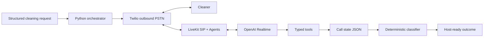
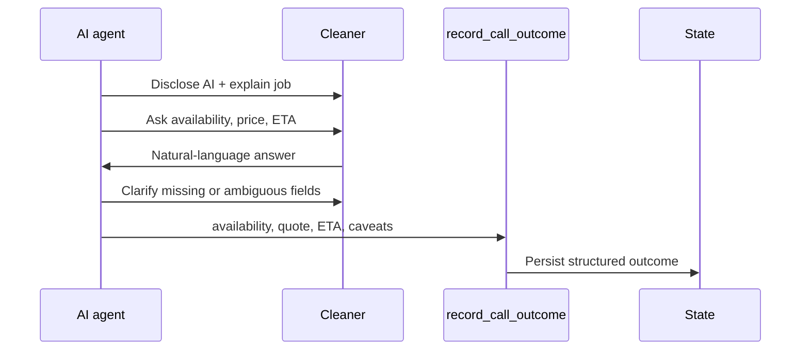
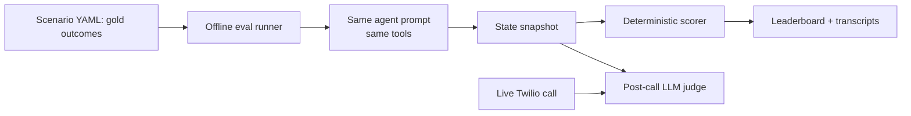

# Design: Outbound Voice Agent

## Job + Product

As a short-term rental host facing a same-day cleaning cancellation, I want to delegate backup-cleaner calls to an AI voice agent so I can recover the turnover before guest check-in.

**Why voice:** the moment is urgent and stressful, and both host and cleaner may be busy or hands-off. A phone call requires no app install, reaches the cleaner immediately, and produces a usable outcome as soon as the call ends.

## Architecture

The LLM handles conversation and extraction; deterministic code owns lifecycle, state, classification, and failure handling.

## Core Decisions

| Requirement                  | Choice                                  | Reason                                                                                                  |
| ---------------------------- | --------------------------------------- | ------------------------------------------------------------------------------------------------------- |
| Foundational model, STT, TTS | OpenAI Realtime `gpt-realtime`          | One low-latency streaming stack for speech in, reasoning, and speech out.                               |
| Telephony                    | Twilio Programmable Voice               | Fastest path to real outbound PSTN calls.                                                               |
| Audio bridge + orchestration | LiveKit SIP + LiveKit Agents            | Avoids custom audio bridging; provides VAD, turn detection, Realtime integration, and tool calling.     |
| Tool calling                 | Typed Python tools                      | Tool schemas stay close to code; LLM mutates state only through explicit functions.                     |
| State                        | Dataclasses + JSON snapshots            | Inspectable enough for demo, evals, and interview walkthrough.                                          |
| Business decisioning         | Deterministic viability classifier      | LLM extracts facts; code decides `viable`, `over_budget`, `past_deadline`, `unclear`, or `unreachable`. |
| Evaluation                   | Custom offline runner + live-call judge | Same prompt/tool/classifier path as live mode; deterministic metrics first, qualitative judge second.   |

## Conversation Contract

The agent must identify itself as AI, collect only the fields needed for the host decision, avoid booking/payment/access commitments, and terminate cleanly on voicemail, no answer, disconnect, or repeated extraction failure.

## Evaluation

| Metric                    | Business question                                                               |
| ------------------------- | ------------------------------------------------------------------------------- |
| Viability accuracy        | Can the host trust the recommendation?                                          |
| Field extraction accuracy | Did we capture availability, price, ETA, and caveats correctly?                 |
| Disclosure compliance     | Did the agent identify itself as AI at call open?                               |
| Tool-call success         | Did structured state get written for every completed call?                      |
| Graceful failure          | Are no-answer, voicemail, ambiguity, and disconnects visible instead of silent? |

## Deliberate Scoping Limits

POC scope is one structured request and one cleaner call. It does not yet include host intake, multi-cleaner ranking, booking confirmation, payment, access handoff, SMS fallback, persistent vendor history, or production compliance infrastructure. Offline evals exercise extraction, tool calls, and classification; STT is validated only by live calls. The highest-leverage next step is synthetic-audio evals that feed spoken gold scenarios through the full Realtime audio path.